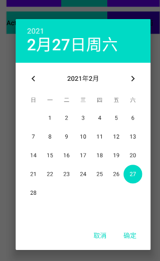

> 安卓代码复用性高,敲过的代码又会忘记,为了避免经常google,记笔记是个好习惯...

## 练习1 ：Activity跳转

* 新建一个MainActivity2，在AndroidManifest.xml中进行注册；在MainActivity的</activity>结尾处并排加入以下；`<activity android:name=".MainActivity2"></activity>`
* 在xml文件里放一个操作跳转的button。
  在onCreate方法里，或者新建的方法中（新建的方法要在onCreate方法中设置自启动）通过id找到button并设置单击i监听，添加意图

```java
button4.setOnClickListener(v-> {
        Intent intent = new Intent (
        MainActivity.this,MainActivity2.class
           );
         startActivity(intent);
  });
```

## 练习2：弹框设计

- **普通弹框**: 

  在布局文件里，设置调出弹框的按钮，并设置号id和单击事件:

```xml
<Button  android:id="@+id/button2_1"
         android:layout_width="match_parent"
         android:layout_height="wrap_content"                        android:background="@color/colorPrimary"
         android:onClick="startNormalDialog1"
         android:text="常规对话框"/>
```

​          Activity中设置onClick对面名字的方法:

```java

public void startNormalDialog1(View view){
    new AlertDialog
        .Builder(this)
        .setIcon(R.drawable.*weixin_1*)//对话框的图标
        .setTitle("删除记录确认")
        .setCancelable(false)
        .setMessage("是否确认删除记录")
        .setPositiveButton("是", 
        new DialogInterface.OnClickListener() {
   @Override
   public void onClick(DialogInterface dialog, int which) {
       Toast.makeText(MainActivity2.this, "成功删除记录",             Toast.LENGTH_SHORT).show();
            }
         })
      .setNegativeButton("否",
       new DialogInterface.OnClickListener() {
    @Override
    public void onClick(DialogInterface dialog, int which) {
        Toast.makeText(MainActivity2.this, "取消删除记录",            Toast.LENGTH_SHORT).show();
       }
       }).show();
}


```

完成效果:


- **单选弹框/多选弹框**

在布局文件里，设置调出弹框的按钮，并设置号id和单击事件

```xml
<Button
android:id="@+id/button2_2"
android:layout_width="match_parent"
android:layout_height="wrap_content"
android:background="@color/colorAccent"
android:onClick="startListDialog1"
android:text="选项列表对话框" />
```


sdf Activity中设置onClick对面名字的方法；

```java
public void startListDialog1(View view){
    String[] colors = {"Green","Blue","Red", "Orange","Purple"};
    
new AlertDialog.Builder(this)
   .setTitle("请选择一种颜色")
   .setCancelable(false)
   .setSingleChoiceItems(colors, 0,
     new DialogInterface.OnClickListener() {
      @Override
     public void onClick(DialogInterface dialog, int which) {
Toast.makeText(MainActivity2.this, "colors[which]", Toast.LENGTH_SHORT)
    .show()
     }
     }).setPositiveButton("ok",null)
    .show();
```

完成效果


- **自定义弹框**

1. 在布局文件里，设置调出弹框的按钮，并设置号id和单击事件

```xml
<Button android:id="@+id/button2_3"
        android:layout_width="match_parent"
        android:layout_height="wrap_content"
        android:background="@color/colorPrimary"
        android:onClick="startCustomDialog1"
        android:text="自定义视图对话框" />
```


​          2.在layout文件夹了自定义设计一个弹框样式

```xml
<?xml version="1.0" encoding="utf-8"?><androidx.constraintlayout.widget.ConstraintLayout xmlns:android="http://schemas.android.com/apk/res/android"android:layout_width="match_parent"android:layout_height="match_parent">
<LinearLayout 
 android:layout_width="match_parent"        android:layout_height="match_parent"
 android:orientation="vertical"
 android:padding="20dp">
    <EditText 
 android:layout_width="match_parent"    android:layout_height="wrap_content"                  android:id="@+id/et_dialog_name"
 android:hint="用户名"/>
    <EditText android:layout_width="match_parent"       android:layout_height="wrap_content"
  android:id="@+id/et_dialog_psw"
  android:inputType="textPassword"
  android:hint="密码"/>
    </LinearLayout>
</androidx.constraintlayout.widget.ConstraintLayout>
```


​       3.Activity中设置onClick对面名字的方法；

```java
public void startCustomDialog1(View view){
 View v = View.inflate(this,R.layout.dialog_view,null);
 EditText etUser=v.findViewById(R.id.*et_dialog_name*);
 EditText etPsw= v.findViewById(R.id.*et_dialog_psw*);
  new AlertDialog.Builder(this)
                 .setTitle("自定义视图")
                 .setCancelable(false)
                 .setView(v)
                  .setPositiveButton("登录", new  DialogInterface.OnClickListener() {
    @Override
    public void onClick(DialogInterface dialog, int which) {
     String username = etUser.getText()
                             .toString()
                             .trim();
     String pwd = etPsw.getText()
                       .toString()
                       .trim();
      Toast.makeText(MainActivity2.this, "用户名："+username+"密码："+pwd, Toast.LENGTH_SHORT)
          .show();
        }
      }).show();
}
```

实现效果


* **日期选择对话框**

①在布局文件里，设置调出弹框的按钮，并设置号id和单击事件

```xml
<Button android:layout_width="wrap_content"        android:layout_height="wrap_content"        android:onClick="startDatePickerDialog1"        android:background="@color/colorAccent"        android:text="日期对话框"/>
```

②Activity中设置onClick对面名字的方法；

```java
public void startDatePickerDialog1(View view){Calendar calendar =Calendar.getInstance();    int year =calendar.get(Calendar.YEAR);    int month = calendar.get(Calendar.MONTH);    int day = calendar.get(Calendar.DAY_OF_MONTH);    new DatePickerDialog(this,     new DatePickerDialog.OnDateSetListener() {    @Override    public void onDateSet(DatePicker view, int year, int        month, int dayOfMonth) {   Toast.makeText(MainActivity2.this,"选中了：" + year+ "年"+   (month+1)+ "月" + dayOfMonth+ "日" ,Toast.LENGTH_LONG);    }     },year,month,day).show();}
```

③效果



## 练习3：安卓常用开关

- 实现actionbar隐藏：`getSupportActionBar().hide();`

- 沉浸模式:在MainActivity中重写以下方法

  ```java
  @Override public void onWindowFocusChanged(boolean hasFocus) {super.onWindowFocusChanged(hasFocus);if (hasFocus && Build.VERSION.SDK_INT >= 19) {    // 如果有焦点，说明当前与用户交互 并且SDK_INT>=19     //只有Android4.4+才支持沉浸式效果     View decorView = getWindow().getDecorView(); decorView.setSystemUiVisibility(View.SYSTEM_UI_FLAG_LAYOUT_STABLE| View.SYSTEM_UI_FLAG_LAYOUT_HIDE_NAVIGATION| View.SYSTEM_UI_FLAG_LAYOUT_FULLSCREEN| View.SYSTEM_UI_FLAG_HIDE_NAVIGATION| View.SYSTEM_UI_FLAG_FULLSCREEN| View.SYSTEM_UI_FLAG_IMMERSIVE_STICKY); }}
  ```

- 打开摄像机拍照

①在xml文件里新建一个调用摄像头的按钮和保存图片的ImageView

```xml
<Button            android:layout_width="match_parent"                          android:layout_height="wrap_content"           android:id="@+id/btn_camera_invoke"           android:text="启动摄像头"/><ImageView android:layout_width="350dp"           android:layout_height="350dp"           android:layout_marginTop="20dp"           android:layout_gravity="center_horizontal"           android:id="@+id/iv_capture_photo"/>
```

②Activity里的代码

```java
public class MainActivity3 extends AppCompatActivity {     private Button btnCamera;     private ImageView ivImage;     private final int CAMERA_REQUEST =10;@Override   protected void onCreate(Bundle savedInstanceState) {   super.onCreate(savedInstanceState);   setContentView(R.layout.activity_main3);    initView3();}@Override   protected void onActivityResult(int requestCode, int        resultCode, Intent data) {   switch (requestCode){   case CAMERA_REQUEST:   if(resultCode == RESULT_OK){   Bitmap bitmap = (Bitmap) data.getExtras().get("data");   ivImage.setImageBitmap(bitmap);   }   break;   }   }public void initView3(){btnCamera = findViewById(R.id.*btn_camera_invoke*);ivImage = findViewById(R.id.*iv_capture_photo*);btnCamera.setOnClickListener(view -> {    //启动本机摄像头Intent intent = new Intent(MediaStore.ACTION_IMAGE_CAPTURE);//启动系统拍照应用，将拍摄的照片返回显示再ImageView组件中         startActivityForResult(intent,CAMERA_REQUEST);});}}
```

## 练习4 ：播放音频

- 播放Raw文件夹下面音频数据

//直接创建，不需要设置setDataSource

```jav
MediaPlayer mMediaPlayer；mMediaPlayer=MediaPlayer.create(this, R.raw.audio);mMediaPlayer.start();
```

//如果从网络加载音乐，如果是从网络中加载那么需要设置网络权限

<!--<uses-permission android:name="android.permission.INTERNET"/>-->

`mMediaPlayer.setDataSource("http://..../xxx.mp3") ;`

//需使用异步缓冲

mMediaPlayer.prepareAsync() ;

②MediaPlayer的常用方法

start();//开始播放

pause();//暂停播放

reset()//清空MediaPlayer中的数据

setLooping(boolean);//设置是否循环播放

seekTo(msec)//定位到音频数据的位置，单位毫秒

stop();//停止播放

relase();//释放资源


- 使用SoundPool播放音频

①xml布局文件中设置一组播放集合

<!-- soundpool音乐播放器-->

```xml
<LinearLayout android:layout_width="match_parent"                     android:layout_height="wrap_content"          android:gravity="center_vertical">    <ListView android:layout_width="match_parent"                      android:layout_height="match_parent"          android:id="@+id/listView"          android:entries="@array/bellname"/></LinearLayout>
```

②在res/values 文件夹中确定以上ListView的属性

```xml
<?xml version="1.0" encoding="utf-8"?><resources>    <array name="bellname">    <item>布谷鸟叫声</item>    <item>风铃声</item>    <item>门铃声</item>    <item>电话声</item>    <item>鸟叫声</item>    <item>水流声</item>    <item>公鸡叫声</item>    </array></resources>
```

③在onCreate方法中，找到listView这个资源；并创建soundpool对象,设置音频相关属性`ListView listView = findViewById(R.id.listView);`

/***********************创建soundpool对象,设置音频相关属性************************/

```java
AudioAttributes attr = new AudioAttributes.Builder()    .setUsage(AudioAttributes.USAGE_MEDIA)    //设置音效使用场景.setContentType(AudioAttributes.CONTENT_TYPE_MUSIC) .build();SoundPool soundPool = new SoundPool    .Builder()    .setAudioAttributes(attr)//设置音效池的属性    .setMaxStreams(10) //设置最多可容纳10音频流.build();
```

④将要播放的音频保存在HASMAP中

```java
/**********将要播放的音频保存在HASMAP中***********/HashMap<Integer ,Integer> soundmap =new HashMap<>();//创建一个hashmap对象soundmap.put(0,soundPool.load(this,R.raw.cuckoo,1));soundmap.put(1,soundPool.load(this,R.raw.chimes,1));soundmap.put(2,soundPool.load(this,R.raw.notify,1));soundmap.put(3,soundPool.load(this,R.raw.ringout,1));soundmap.put(4,soundPool.load(this,R.raw.bird,1));soundmap.put(5,soundPool.load(this,R.raw.water,1));soundmap.put(6,soundPool.load(this,R.raw.cock,1));
```

⑤ SoundPool的几个重要的方法

几个load方法和上文提到的MediaPlayer基本一致，这里的每个load都会返回一个SoundId值，这个值可以用来播放和卸载音乐。

int load(AssetFileDescriptor afd, int priority)
int load(Context context, int resId, int priority)
int load(String path, int priority)
int load(FileDescriptor fd, long offset, long length, int priority)

1. 通过流id暂停播放`final void pause(int streamID)`
   播放声音，soundID:音频id（这个id来自load的返回值）； left/rightVolume:左右声道(默认1,1)；loop:循环次数(-1无限循环，0代表不循环)；rate:播放速率(1为标准)，该方法会返回一个streamID,如果StreamID为0表示播放失败，否则为播放成功`final int play(int soundID, float leftVolume, float rightVolume, int priority, int loop, float rate)`

2. 释放资源(很重要)`final void release()`
3. 恢复播放`final void resume(int streamID)`

4. 设置指定id的音频循环播放次数`final void setLoop(int streamID, int loop)`
5. 设置加载监听(因为加载是异步的，需要监听加载，完成后再播放)`void setOnLoadCompleteListener(SoundPool.OnLoadCompleteListener listener)`
6. 设置优先级(同时播放个数超过最大值时，优先级低的先被移除)`final void setPriority(int streamID, int priority)`
7. 设置指定音频的播放速率，0.5~2.0(rate>1:加快播放，反之慢速播放)`final void setRate(int streamID, float rate)`
8. 停止指定音频播放`final void stop(int streamID)`
9. 卸载指定音频，soundID来自load()方法的返回值`final boolean unload(int soundID)`
10. 暂停所有音频的播放`final void autoPause()`
11. 恢复所有暂停的音频播放`final void autoResum()`