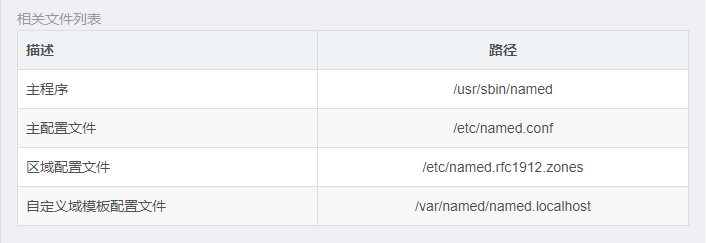

> ## 预备：
>
> * 关掉防火墙systemctl stop firewalld.service，关掉开机 启动`systemctl disable firewalld.service`。关掉 selinux 查看：`getenforce ` (disabled为开启)  /usr/sbin/sestatus -v (SELinux status: disabled为关闭，enable为开启)           临时关闭：`setenforce 0    `       永久关闭：vi /etc/selinux/config   将SELINUX=enforcing改为SELINUX=disabled 设置后需要重启才能生效
>   1.  Dns的安装包：bind ，bind-chroot 监牢模式(改变根目录)；yum install bind bind-chroot③chroot把根目录放到 /var/named/chroot
>   2. Dns的两个配置文件位置①主配置文件/etc/named.conf   ② 解析文件（区域数据库文件） /var/named/ 下
>   3. 不适用监牢模式的话，直接配置 步骤2里的①②即可。
>   4. 检查dns安装的工具nslookup ，dig  yum install bind-utils
>
> 配置：Linux  IP 192.168.118.201           DSN  192.168.118.201要求：     [web.kevin.com](http://web.wei.com/)    192.168.1.1     [ftp.kevin.com](http://ftp.wei.com/)    192.168.1.2        [mail.kevin.com](http://mail.wei.com/)   192.168.1.3可先查询是否已经安装：`rpm -q bind` `rpm -q bind-chroot`
>
> * **查看本机dns：`cat /etc/resolv.conf**`
>
> 


### **步骤:**

1. 编辑DNS的主配置文件，创建区域kevin.com新建named.conf[root@wei named]# ` vi /var/named/chroot/etc/named.conf` 填写内容 ：

```
options{
   directory "/var/named";
   };
   zone "kevin.com"{
   type master;
   file "kevin.com.zone"
   };
```

2. 复制记录文件的模板，并编辑[root@wei named]# 

* `cd /usr/share/doc/bind-9.9.4/sample/var/named/`

  [root@wei named]# `cp named.localhost /var/named/chroot/var/named/kevin.com.zone`

  ```配置文件
  $TTL 1D
  @ IN SOA kevin.com. 123456.qq.com. (
  0 ; serial
  1D ; refresh
  1H ; retry
  1W ; expire
  3H ) ; minimum
  NS dns01.kevin.com.
  dns01 IN A 192.168.196.132
  web IN A 192.168.1.1
  ftp IN A 192.168.1.2
  IN  MX 10 mail.kevin.com.
  mail IN A 192.168.1.3
  ```

3. 启动named服务

​        [root@wei named]#`systemctl start named-chroot`

​        [root@wei named]#` systemctl start named`
​         开机自动启动

​         [root@wei named]# `systemctl enable named-chroot`

​         [root@wei named]#` systemctl enable named`

​         查看端口53：`ss -antp | grep named`

4. 测试

​         nslookup  输入  server    输入web.kevin.com  返回地址 192.168.1.1 输入         [ftp.kevin.com](http://ftp.kevin.com/)  返回地址 192.168.1.2 输入 [mail.kevin.com](http://mail.kevin.com/)   返回地址 192.168.1.3dig -t A [web.kevin.com](http://web.kevin.com/)   返回  [web.kevin.com](http://web.kevin.com/) IN A 192.168.1.1     sns01.kevin.com.  IN A 192.168.118.201

