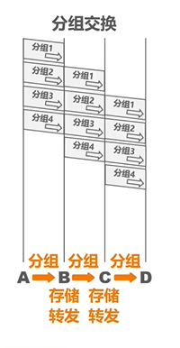
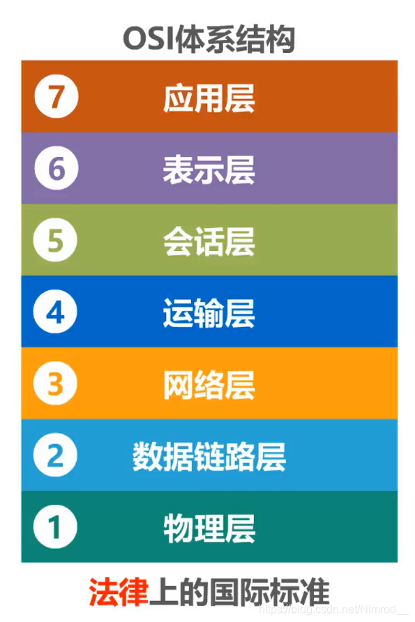

> 本笔记转载于CSDN平台作者：[Nimrod__](https://blog.csdn.net/Nimrod__)的《从零开始的计网学习——计算机网络概述》，与bilibili视频：[计算机网络微课堂——湖科大](https://www.bilibili.com/video/BV1c4411d7jb)  同步对应，我是先看的视频准备自己记一下笔记的，发现视频评论下有人整理好了，而且很全很细致，就直接收藏了。

## **1 计算机网络中在信息时代的作用**

计算机网络已由一种通信基础设施发展成为一种重要的信息服务基础设施。计算机网络已经成为像水、电这些基础设时一样，成为我们生活重不可或缺的一部分。

## 2  因特网概述

#### 2.1网络、互联网和因特网

网络：网络由**若干节点和连接这些节点的链路**组成。

互联网：是一个覆盖范围更大的网络，由多个网络还可以通过路由器连接起来，可以理解为**互联网就是网络的网络**。因特网：就是**世界上最大的互联网**。

区分：

internet：互联网，这是一个通用名词，泛指由多个计算机网络互联而成的网络，网络之间的通信协议可以是任意的。

Internet：因特网，专有名词，指当前全球最大的、开放的、由众多网络相互连接而成的特定计算机网络，是采用TCP/IP写一族作为通信的规则。

#### 2.2 因特网发展的三个阶段

**因特网服务提供者ISP(Internet Service Provider)**

提供给用户IP地址的角色，每个用户通过ISP提供的IP地址使用互联网，没有IP地址不可以使用互联网。

生活中电信等便是最经典的例子，其中在互联网中每个用户都可以是ISP。

基于ISP的三个结构互联网

#### 2.3 因特网的标准化工作

#### 2.4 因特网的组成

边缘部分：由所有连接在因特网的主机组成，是用户**直接使用的，用来通信和资源共享的设备**。

核心部分：由**大量网络和连接这些网络的路由器组成**，这部分是为边缘服务提供服务的。

## 3 三种交换方式

#### 3.1 电路交换

电话交换机接通电话线的方式称为电路。从通信资源的分配角度来看，交换就是按照某种方式**动态的分配传输线路的资源**。

在图中，每个电路交换都需要建立一条物理通路，每条连接都是不可抢占，一直存在的。电路交换的步骤：

- 建立连接（分配通信资源）
- 通话（一直占用通信资源）
- 释放连接（归还通信资源）

在建立后不论通信资源有没有使用，都不会进行中断，除非用户中断。

#### 3.2 分组交换

把整块数据/信息分为多个数据段（相对于报文传输而言），数据段分开传输。在数据段前面加上首部后，成为一个分组。以分组为单位传输。

在图中各个节点有存储转发的功能。各个分组交换机会把分组先存储下来，然后根据其头部信息种的目的地地址，发送给下一个交换机。各个交换机进行对分组信息的储存转发后，最终到达主机H2。目的地处理及再去除分组首部，还原出报文。传输完成。在转发过程中有两个特点：

- 各分组从源站到达目的地可以走不同的路径。

- 分组到达目的站的顺序不定，可能出现顺序变化。

- 在分组传输中各个角色主要功能：

#### 3.3 报文交换

每一个结点接收整个报文，检查目标结点地址，然后根据网络中的通信情况在适当的时候转发到下一个结点。经过多次的存储——转发，最后到达目标，因而这样的网络叫存储——转发网络。其中的交换结点要有足够大的存储空间（一般是磁盘），用以缓冲收到的长报文。

#### 3.4 三种交换对比

电路交换：

在电路交换过程中要先进行建立连接，连接建立完成后直接进行报文传输，传输完成后释放连接。传输时以**比特流直通形式**传输。

报文交换：

在报文交换中，把整个报文先传送到相邻节点交换机，节点交换机进行储存下来后进行查表转发，转发到下一个节点交换机。

分组交换：

分组交换可以随时发送分组，不需要事先建立连接。
将原始报文拆分成一个个分组，依次在各节点交换机上储存转发。各节点在发送分组的同时还需要缓存分组，提升效率。

#### 3.5 优缺点对比

电路交换

优点：

- 通信时延小，适合传输大量数据

- 有序传输，只在一条固定线路传输，不会失序

- 没有冲突，只在一条线路传输，不会引发冲突

- 适用范围广，适合模拟信号和数字信号

- 实时性强

- 控制简单，结构简单，易于控制

 缺点：

- 建立连接时间长

- 线路独占，使用效率低

- 灵活性差

- 难以规格化

报文交换：

优点:

- 无需建立连接，可以随时发送报文

- 动态分配线路

- 提高线路可靠性，若线路故障会选择正常线路

- 提高线路利用率

- 提供多目标服务，一个报文可以同时发送给多个地址

缺点：

- 引发了转发时延，在节点中转发储存时间花费多

* 需要较大储存缓存空间

- 需要传输额外的信息量，报文中有源地址点多余信息

分组交换：

优点：

- 无需建立连接

- 线路利用率高

- 简化了储存管理，分组长度固定，缓冲区固定，易于管理

- 加速传输，节点的转发和缓存同时进行，提高速度

- 减少出错概率和重发数据量

缺点：

- 引发了转发时延

- 需要传输额外的信息量，分组中有源地址等额外信息量

- 对于数据报服务，处在失序、丢失货重复分组的问题

- 对于虚电路服务，存在呼叫建立、数据传输和虚电路释放三个过程

## 4 计算机网络的定义和分类

#### 定义：计算机在实际上没有精确统一的定义。

但是有一个最简单的定义：互连、自治的计算机集合。
其中：

 互连指的是计算机之间可以通过有线或者无线的方式进行数据通信。

 自治指的是独立的子算计，拥有自己的硬件和软件，可以独立运行。

 计算机集合指的是至少要有两台计算机。

比较全面的定义是：

计算机网络主要是一些通用的、可编程的硬件互连而成的，而硬件并非专门用来实现某一特定目的的，这些可编程的硬件能够用来传送多种不同类型的数据（如音频、数据），这些可编程的软件能支持广泛和日益增长的应用。

在实际生活中不同的发展阶段对计算机网络的定义不同，对其的定义反应了当时的网络技术发展水平。

#### 分类：

 

公用网指的是电信公司构建的大型网络，**面对公众开放**，只要交钱既可使用，又叫公众网。

专用网指的是某个部门为本单位的特殊业务工作需要而建造的网络。例如铁路部门、电信部门**专门为自己构建的，不对外开放**的网络。

有线网络主要双绞线(日常使用网线)、光纤。

无线网络主要是WIFI。

**广域网WAN：**覆盖面积通常为几十公里到几千公里，可以覆盖国家范围、洲际范围，有时也成为远程网。负责互连分布在不同区域的城域网和局域网，是最大范围的网络。

**城域网MAN：**覆盖范围一般是一个城市。作用距离为5到50公里。通常作为城市骨干网，互连大量企业、机构、学校。

**局域网LAN:**局域网一般是微信计算机或工作站通过告诉线路相连，范围一般是一个实验室、一栋楼或一个校园。通常由某个单位单独拥有、使用和维护。

**个域网PAN：**个人区域网络。非用来连接普通计算机，耳式在个人工作的地方把个人使用的电子设备，鼠标、键盘、耳机等用无线的方式连接起来形成的个人网络系统。

**总线型网络：**

总线型网络用**单根传输线**把计算机连接起来。

优点是**建网容易，增减节点方便，节省线路**。

缺点是**重负载时通信效率不高，任意一处出现故障后全网瘫痪**。

星型结构：

星型网络是将每个计算机都以单独的线路与中央设备相连。中央设备现在一般是交换机。

**优点：**便于网络的**集中控制和管理**。

**缺点：****成本高，中央设备对故障敏感**。

环形结构：

环形网络是将所有计算机网络接口连接成一个环。环可以是单环或者双环，环中信号是单项传输的。

网状型结构：

在网状结构中，每个节点至少由两条路径与其他节点相连接，多用在广域网中。

优点：**可靠性高**。

缺点：**控制复杂，线路成本高**。

**在以上四种结构中可以组合任意的更加复杂有效的结构。**

## 5 计算机网络中的性能指标

性能指标可以从不同的方面来度量计算机网络的性能。

常用的性能指标有8个 ⬇

#### 速率：

首先先了解比特：

比特：计算机中**数据量的单位**，也是信息论中信息量的单位。一个比特就是二进制数字中的一个1或0。

基本单位：bit(b) 比特
常用单位：

			8 bit = 1 Byte
			
	        KB = 2^10B
	          
	        MB = K KB = 2^20 B
	          
	        GB = K MB = 2^30 B
	          
	        TB = K GB = 2^40 B

速率就是**连接在计算机网络上的主机在数字信道上传送比特的速率**，也称为**比特率或数据率**。

基本单位：bit/s(b/s，bps)

常用单位：

			kb/s = 10^3b/s
			
	        Mb/s = K Kb/s = 10^6 b/s
	        
	        Gb/s = k Mb/s = 10^9 b/s
	        
	        Tb/s = k Gb/s = 10^12 b/s

注意！！

数据单位bit中K = 2^10B

数据单位bit中K = 10^3B

所以在计算过程中二者存在一定差距，不要弄错了。

带宽：
带宽在模拟信号系统中表示的是信号所包含的各种不同频率成分所占据的频率范围，也就是传输过程中最大频率与最小频率的范围。

带宽中计算机网络中的意义：

用来表示网络的通信线路所能传送数据的能力，因此网络带宽表示在单位时间内从网络中的某一点到另一个点所能通过的“最高数据率。

单位：b/s(kb/s, Mb/s, Gb/s, Tb/s)，与速率相同。

在日常生活中的宽带带宽除以8，一般就是平时使用中的最高传输速率。（1B = 8bit）

是一个很重要的计算机网络性能指标。直接关系网络的应用体验。

吞吐量：
吞吐量表示在单位时间内通过某个网络（或信道、接口）的数据量。

吞吐量被经常用于对现实世界中的网络的一种测量，以便知道实际上到底有多少数据量能够通过网络。

吞吐量受网络的带宽或额定速率的限制。

时延：
发送时延：源主机将分组发送出去产生的时延。

计算方式： 分组长度(b) / 发送速率(b/s)。

发送速率 = min[网卡发送速率，信道带宽，交换机或路由器的接口速率]

发送效率是一个短板效应，由速率最低的模块决定，所以在选择网线、路由器等设备时，要考虑到整体的速率平衡问题。

传播时延:分组在线路中传播产生的时延。

计算方式：信道长度(m) / 电磁波传播速率(m/s)

处理时延：路由器收到分组后对其进行存储转发产生的时延。

一般不方便计算。

时延宽带积：
传播时延和带宽的乘积。

若发送端连续发送数据，则在所发送的第一个比特即将到达终点时，发送端就已经发送了时延带宽积个比特。

实际上就是一个比特到达终点的单位时间内传输的比特个数。

链路的时延带宽积又称为以比特为单位的链路长度。

往返时间RTT：
一个网络请求双向交互一次所需的时间。

往返时间RTT也是一个重要的性能指标

可以更好的了解到网络的情况。

利用率：
信道利用率：用来表示某信道有百分之几的时间是被利用的（有数据通过）。

网络利用率是全网络的信道利用率的加权平均。

根据排队论，当某信道的利用率增大时，该信道引起的时延也会迅速增大。如图所示：

当网络利用率达到50％时，时延就要加倍。

当网络利用率超过50％时，时延就急剧增大。

当网络利用率接近100％时，时延趋于无穷大。

因此要控制信道利用率不超过50％，否则就要准备扩容。

丢包率：
丢包率即分组丢失率，是指在一定的时间范围内，传输过程中丢失的分组数量与总分组数量的比率。

丢包率具体可分为接口丢包率、结点丢包率、链路丢包率、路径丢包率、网络丢包率等。

分组在传输过程中出现误码，被结点丢弃。

分组到达一台队列已满的分组交换机时被丢弃，在通信量较大时就可能造成网络拥塞。

丢包率反映了网络的拥塞情况。

无拥塞时丢包率为0

轻度拥塞时丢包率为1％—4％

严重拥塞时丢包率为5％-15％

## 6 计算机网络体系结构

#### 6.1 常见的计算机网络体系结构

OSI体系结构：

**是法律上的国际标准。**
TCP/IP体系结构

是实际上的国际标准。

TCP/IP体系结构相当于：

将OSI结构的物理层和数据链路层合并成为网络接口层，去掉了会话层和表示层。

在TCP/IP协议中的网络接口层并没有规定什么具体的内容，目的是为了允许任何形式的网络接口使用TCP/IP协议。

所以实际上TCP/IP协议只有三层：网际层、运输层、应用层。

其中：

网际层核心协议是IP协议。

运输层的两个重要协议：TCP(可靠传输)、UDP(不可靠传输)。

应用层有大量的应用协议：HTTP、SMTP等等。

层次之间关系：

此种结构的出现时便于学习。

此种结构相当于把TCP/IP协议中的网络接口层还原成数据链路层、物理层。网际层还原成网络层。

**在接下来的学习中主要使用该种模型。**

#### 6.2 计算机网络结构分层的必要性

1、计算机网络是个非常复杂的系统

2、“分层”可将庞大而复杂的问题，转化为若干较小的局部问题

基于以上原因选择对计算机网络进行分层。

其中各层的主要解决问题：

物理层：

采用怎样的传输媒体（介质）？
采用怎样的物理接口？
使用怎样的信号表示比特0和1？

解决以上问题后就可以实现01信号在计算机之间的传输。

数据链路层：

如何标识网络中的各主机（主机编址问题，例如MAC地址）？

如何从信号所表示的一连串比特流中区分出地址和数据？

如何协调各主机通信（例如，各主机争用总线，交换机的实现原理）？

解决此问题后可以实现分组在一个网络上传输。

网络层：
如何标识各网络以及网络中的各主机（网络和主机共同编址的问题，例如IP地址）？

路由器如何转发分组，如何进行路由选择?

解决此问题后可以实现分组在网络间传输。

运输层：

如何解决进程之间基于网络的通信？

出现传输错误时如何处理？

解决此问题后可以实现进程之间基于网络的通信。

应用层：

通过应用进程间的交互来完成特定的网络应用。

例如：支持万维网应用的HTTP协议，支持电子邮件的SMTP协议，支持文件传送的FTP协议。

解决此问题后可以实现计算机网络所解决的所有问题。

在此一层一层的问题解决中边逐步从物理层、数据链路层、网络层、运输层、应用层结局问题，实现目的，这也是分层思想解决问题的最好提现。

#### 6.3 计算机网络体系结构分层思想举例

以易于学习的五层结构思想为例：

在五层结构中，各层负责任务如下：

应用层：按照http请求的协议，构建报文。然后交付给运输层处理。

运输层：给http请求加上一个头部，使其成为一个TOP报文段。其头部的作用是识别进程和实现可靠传输（TCP的特点）。而后交给网络层处理。

网络层：给TCP报文段加上一个IP头部，使其成为IP数据报。其首部作用是为了使该数据段可以在互联网上传输。而后将其交付给数据链路层处理。

数据链路层：给IP数据报添加一个首部和一个尾部，使其成为帧（按帧传输）。

其首部的作用是使其能够在一段链路或者网络上传输，以及被目的交换机接收并处理。

其尾部的作用是为了让目的主机检查是否有误码。

最后将其交给物理层。

物理层：将帧看作是比特流（01编码），由于是在以太网传输，因而给其加上前导码，便于传输。并且将其变成相应的信号发送到传输媒体。

此时，发送端处理结束。

由于接收端的过程就是发送端的逆过程。

#### 6.4计算机网络体系结构中的术语

**实体：**

实体是指**任何可发送或接收信息的硬件或软件进程。**

对等实体是指**通信双方相同层次中的实体。**

在此图中，A、B等是实体，A、H是对等实体。

**协议：**

协议是**控制两个对等实体进行逻辑通信的规则的集合**，例如TCP/IP协议。

协议的三要素：语法，语义，同步。

语法定义所交换信息的格式。例如，IP数据报的格式。

语法定义了所交换信息由那些字段以及何种顺序构成。

语义定义通信双方所要完成的操作。例如，主机HTTP的GET请求给Web服务器，Web服务器收到后执行相应的操作，然后给主机发回HTTP的响应。

同步定义通信双方的时序关系。例如，TCP的“三报文握手”建立连接。

对等层次之间传送的数据包称为该层的协议数据单元PDU。
举例：

应用层：报文(message)

运输层：TCP报文段(segment)或UDP用户数 据报(datagram)

网络层：分组(packet)或IP数据报

数据链路层：帧(frame)

物理层：比特流(bit stram)

以上的便是各层的协议数据单元PDU。

协议对于实体来说是抽象的，看不见内在，只能看见提供的功能。

服务：

在协议中，每层不但要实现本层协议，还要使用下一层所提供的服务。

并且在协议的控制下，两个对等实体间的逻辑通信要是的本层能够向上一层提供服务。

协议是水平的，服务是垂直的。

服务访问点：在同一系统中相邻两层的实体交换信息的逻辑接口，用于区分不同的服务类型。

示例：

数据链路层的服务访问点为帧的“类型”字段。

网络层的服务访问点为IP数据报首部中的“协议字段”。

运输层的服务访问点为“端口号”。

服务原语：上层使用下层所提供的服务必须通过与下层交换一些命令。

服务数据单元SDU：同一系统内，层与层之间交换的数据包。

多个SDU可以合成为一个PDU；一个SDU也可划分为几个PDU。

#### 结束语

本笔记主要是计算机网络概述部分，在此部分中主要学习一些概念性的术语。后面还有物理层、数据链路层、网络层、传输层、应用层的具体知识学习，由于内容太多没有转载过来，感兴趣的朋友可以去<u>[查看作者原文](https://blog.csdn.net/Nimrod__/article/details/113127311)。</u>

