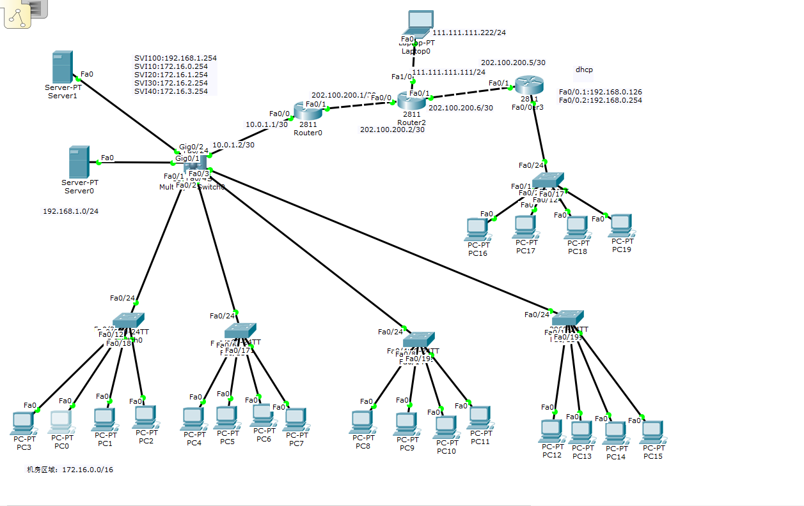

## 第一步：在左边校区加一个web服务器

​    地址设置为：`192.168.1.100:80/24`,网关：192.168.1.257把服务器划入vlan 1000

## 第二步：在左边接入互联的Nat路由机器上开启端口映射：

全局配置模式:`ip nat inside source static tcp 192.168.1.100 80 202.100.200.1 80`
测试用笔记本访问网站，访问方法：202.100.200.1<!--第一二步实现外网电脑访问内网特定服务器-->

## 第三步：GRE隧道技术：

在两端路由器上创建隧道接口
左边NAT：`int tunnel 1`
设置地址：`ip address  192.168.88.1 255.255.255.252`
源端口：`tunnel source Fa0/1`
目的ip：`tunnel destination 202.100.200.5`

右边路由器 int tunnel 1
设置地址：`ip address  192.168.88.2 255.255.255.252`
源端口：`tunnel source Fa0/1`
目的ip：`tunnel destination 202.100.200.1`

## 第四步：添加静态路由：（路由器与路由器相通）
左边路由器：`ip route 192.168.0.0 255.255.255.0 192.168.88.2`
查看：`show ip route`

右边路由器：`ip route 192.168.1.0 255.255.255.0 192.168.88.1`
                 `  ip route 172.16.0.0  255.255.0.0  192.168.88.1`
查看：`show ip route`

##  第五步：多校区校园网：

给机房接入层交换机设置VLAN10-40，上联接口设置Trunk，给三层交互机设置VLAN10-40，Vlan 100.串口封装，设置Trunk，开启路由把Fa0/1-4接入trunk，把Gig0/1口接入VLAN100；

## 第六步： 设置各vlan的ip地址：

`SVI100:192.168.1.254`
`SVI10:172.16.0.254`
`SVI20:172.16.1.254`
`SVI30:172.16.2.254`
`SVI40:172.16.3.254`

设置三层交换机上联接口点对点通讯ip地址：`10.0.1.2/30`。设置ip前要先
打：`no swithport` 指令。

## 第七步：配置DHCP服务器

设置与三层交互机相联的路由器点对点Fa0/0ip地址设置从路由器到内网各网段的路由。`ip route 192.168.1.0 255.255.255.0` `ip route  172.16.0.0 255.255.252.0(把172.16.0/1/2/3.0融合)`

配置DHCP服务器，给VLAN10-40分配ip地址。在三层交换机上配置dhcp中继。开启：`service dhcp `进入VLAN，`ip helper-address dhcp `服务器地址

