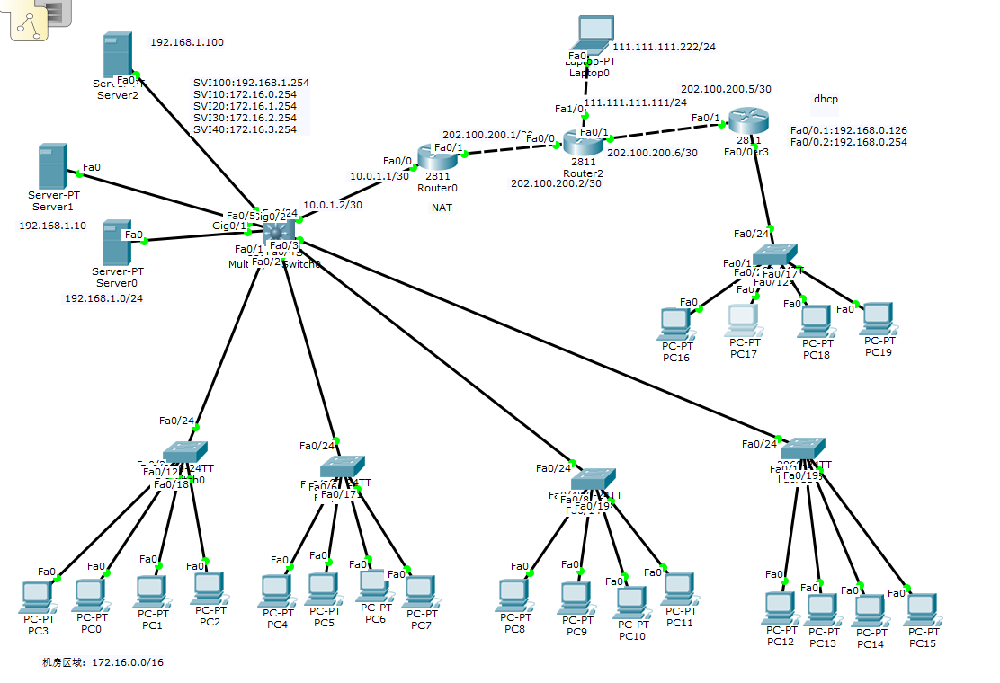

## 第一步：设置各二层交换机的VLAN1的ip地址

①`192.168.44.1/24`②`192.168.44.2/24`③`192.168.44.3/24`④`192.168.44.4/24`然后`no shutdown`,在三层交换机上设置VLAN1的ip地址`192.168.44.254/24`。在二层交互机上加网关,全局配置模式下输入：`ip default-gateway192.168.44.254`

## 第二步：上传和下载配置文件

* 上传：

  ①在二层交互机保存配置
  ②copy startup-config tftp:
  ③输入远程主机地址：192.168.1.10
  ④远程主机取名

* 下载：

  ①ping 192.168.1.10
  ②copy tftp: startup-config 
  ③输入远程主机地址：192.168.1.10
  ④远程主机取名
  ⑤重启：reload
  ⑥查看：show vlan
  ⑦重设vlan 1 的ip地址， no shutdown

## 第三步： 配置网络路由

* 把模拟互联网的笔记本ip设置成：`111.111.111.222/24。`设置网络路由器：
  ①设置与左边相连的端口`ip：202.100.200.2/30（255.255.255.252）`
  ②设置与右边相连的端口`ip：202.100.200.6/30（255.255.255.252）`
  ③设置与互联网相连的端口`ip:111.111.111.111/24`

* 配置两个局域网的出口网关：
  ①左边：`202.100.200.1/30（255.255.255.252）no shutdown`
  设置好后去测试`ping 202.100.200.2`
  ②右边：`202.100.200.5/30（255.255.255.252）` `no shutdown`
  设置好后去测试`ping 202.100.200.5`

* 添加静态路由:

  ①在左边汇聚层交换机添加默认路由（全局配置模式）
  ip route  0.0.0.0  0.0.0.0  10.0.1.1
  查看是否添加成功：show ip route
  ②出口网关默认路由
  ip route 0.0.0.0  0.0.0.0  202.100.200.2
  查看是否添加成功：show ip route 
  ③右边网关添加默认路由：
  ip route 0.0.0.0  0.0.0.0  202.100.200.6
  查看是否添加成功：show ip route 

## 第四步：机房电脑连互联网

* 左边出口网关路由器上设置net

  ①进入路由器左边的接口配置：ip nat inside
  ②进入路由器右边的接口配置：ip nat outside
  ③定义内网主机集合：
  access-list 1 permit 192.168.1.0  0.0.0.255
  access-list 1 permit 172.16.0.0  0.0.255.255
  ④做端口映射
  ip nat inside source  list 1 interface 出口端口 overload
  ⑤查看：show run

* 右边出口网关路由器设置net

  ①进入路由器入口的接口配置（子端口int f0/0.1和int f0/0.2）：ip nat inside
  ②进入路由器出口的接口配置：int nat outside
  ③定义内网主机集合：
  access-list 1 permit 192.168.0.0  0.0.0.255
  ④做端口映射
  ip nat inside source  list 1 interface 出口端口 overload
  ⑤查看：show run

